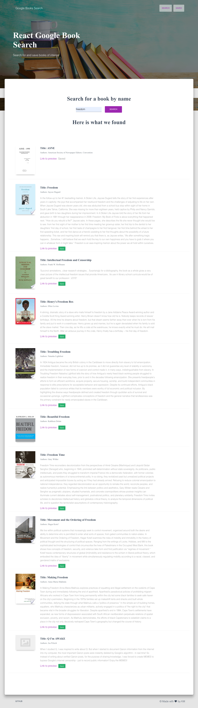
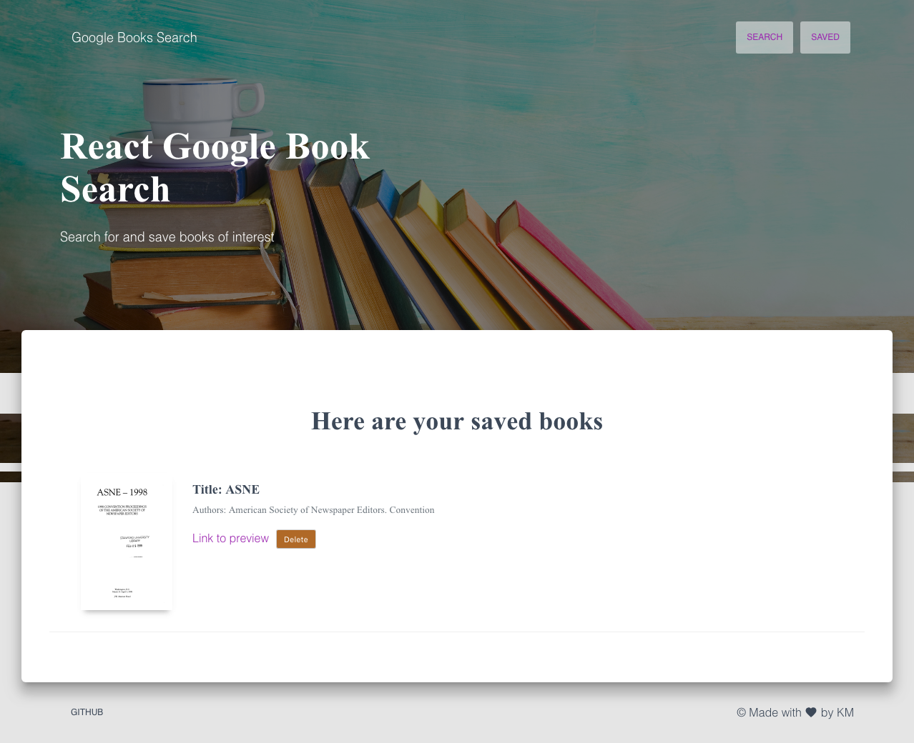

# Google Books Search

### Overview

A React-based Google Books Search app. This Single Page Application uses React components, helper/util functions, and React lifecycle methods to query and display books based on user searches.

### Description

- This application has 2 pages:

  - [Search] - User can search for books via the Google Books API. User has the option to "View" a book, bringing them to the book on Google Books, or "Save" a book, saving it to the Mongo database.

  - [Saved] - Renders all books saved to the Mongo database. User has an option to "View" the book, bringing them to the book on Google Books, or "Delete" a book, removing it from the Mongo database.

- Each books has each of the following fields:

  - `title` - Title of the book from the Google Books API

  - `authors` - The books's author(s) as returned from the Google Books API

  - `description` - The book's description as returned from the Google Books API

  - `image` - The Book's thumbnail image as returned from the Google Books API

  - `link` - The Book's information link as returned from the Google Books API

### Tech:

- [React]
- [node.js]
- [express.js]
- [mongoose]
- [MongoDB]
- [axios]
- [Material UI]

### Application screenshots

